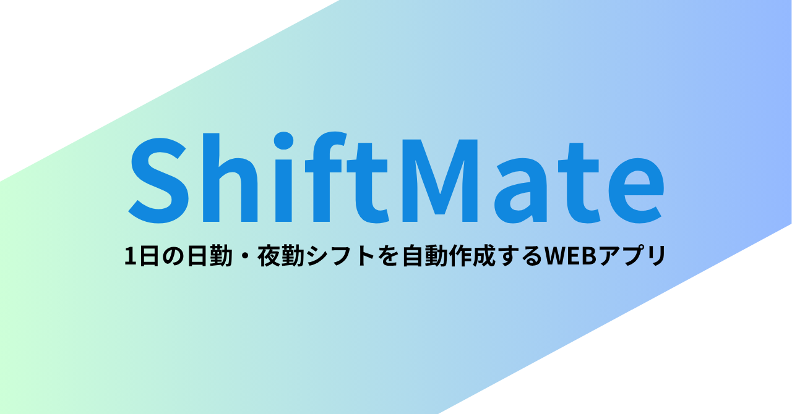
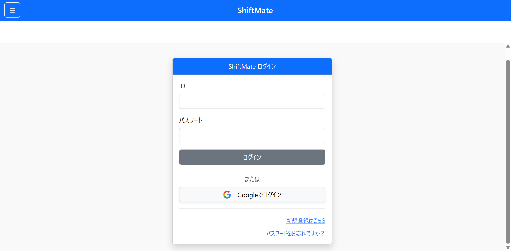
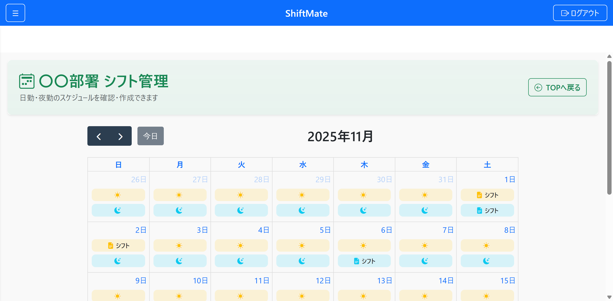
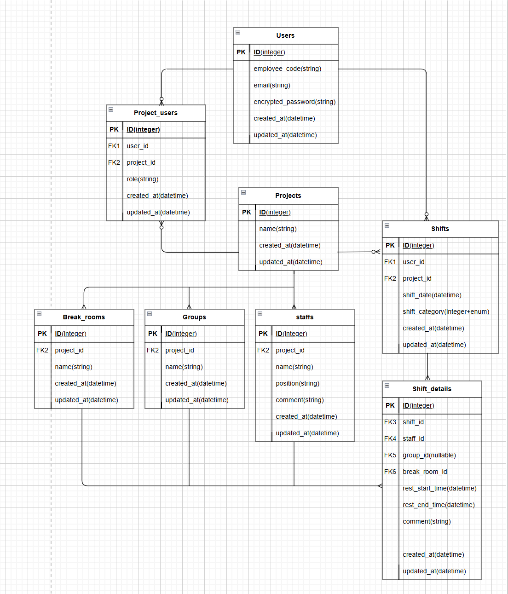

# ShiftMate

## 目次
- [アプリ概要](#アプリ概要)
- [サービスURL](#サービスURL)
- [サービス開発の背景](#サービス開発の背景)
- [ユーザ層について](#ユーザ層について)
- [機能紹介](#機能紹介)
- [技術構成について](#技術構成について)
  - [使用技術](#使用技術)
  - [ER図](#ER図)
  - [画面遷移図](#画面遷移図)
  
  
## アプリ概要
**日勤・夜勤の一日のシフト作成アプリケーション**  
本アプリケーションは、夜勤・日勤スタッフの仮眠・休憩シフトを自動で振り分けできる管理ツールです。    
スタッフや休憩室の条件を設定するだけで、最適なシフトを短時間で作成できます。  
管理者のシフト調整時間を大幅に削減し、管理業務の効率化を実現します。  
  
  
## サービスURL
https://shiftmate-app-f4dad2196d7c.herokuapp.com/
  
  
## サービス開発の背景
私は現在24時間体制の職場で勤めており、日勤や夜勤勤務では複数のスタッフ（約10～20名）と交代で仮眠休憩をとっています。そこでの一日のシフト作成は、管理者が休憩や人員配置のシフト調整を紙に手書きで行っており、作成完了までにかなりの手間や時間を要していました。  
この作成作業をアプリ化することで作成時間や手間を短縮することができると考え、今回の開発に至りました。  
  
  
## ユーザー層について
**医療機関、コールセンター、物流センターなど**  
24時間稼働しており仮眠休憩が交代で必要な職場における、管理者の利用を想定しています。  
  
  
## 機能紹介
### ログイン画面

  
「ID」「メールアドレス」「パスワード」「確認用パスワード」を使用してユーザー登録を行います。  
「ID」は社員IDコードなどを想定しています。ログインは「ID」「パスワード」でログイン処理を行います。  
また、Googleアカウントを用いてGoogleログインを行うことも可能としました。
  
  
### プロジェクト(施設)選択
管理者が複数のプロジェクト(施設)でのシフト作成を行う可能性も考慮し、プロジェクト(施設)を選択するとカレンダーページに遷移します。カレンダーでは日勤と夜勤のシフトの新規作成、作成済シフトの参照を行うことができます。  

  
  
## シフト作成：夜勤編
**夜勤[ブルー]のアイコンでシフト作成画面へ進みます。シフト作成は2STEPです。**
  
### 1. スタッフ・休憩(仮眠)室選択
勤務スタッフの人数にあった休憩室を選択します。
  

  
  
### 2. グループ選択
グループは施設内での担当や小グループのこと指します。
例：リーダー、〇階担当、救急部門、指令室担当、品質担当 など
  
  
### 3. シフト表示
下記条件を基にシフト自動作成します。
- **他のスタッフと同じ時間に休憩室は被らない**  
- **グループ内のスタッフで休憩時間が被らない**
- **深夜帯（0時～6時）で優先的に休憩を配置する**
- **深夜帯に入りきらない休憩は深夜帯に近い時間（22時～0時）で配置する**
  

  
  
### 4. 編集画面
シフト自動作成後に「休憩場所」「休憩開始時間」「コメント」の編集が可能です  
スタッフの希望などに合わせて自由に調整が可能です。 
   

  
  
## シフト作成：日勤編
**日勤[オレンジ]のアイコンでシフト作成画面へ進みます。シフト作成は2STEPです。**  
  
### 1. スタッフ選択  
  
### 2. グループ/休憩希望選択  

  
  
### 3. シフト表示
選択した情報を基にアプリがシフトを自動作成します。  
**休憩希望がないスタッフは同じグループ内で休憩時間の偏りがないように自動配置します。**
表示画面で管理者はシフトを編集可能です。
   

  
  
## シフトの出力
作成したシフトは保存され、カレンダーから参照・編集が可能となります。  
また、作成したシフトをPDF出力でき印刷することも可能です。  
  
  
## 技術構成について
### 使用技術
### バックエンド
- Ruby: 3.3.6
- Ruby on Rails: 8.0.2.1
- PostgreSQL(データベース)
- Heroku

### フロントエンド
- HTML/CSS
- Javascript
  - stimulus(シフト手動編集時のUI)
  - Select2(シフト作成時のスタッフ名の検索/複数選択)
 
### gem
- devise:ログイン
- pundit:権限管理
- simple_form
- full_calendar
- kaminari (ページネーション)
- ActionMailer
- wickedPDF (PDF作成)
- SecureRandom (招待機能のToken管理)
- omniauth (google認証)
  
  

### ER図

  

### 画面遷移図
Figma： https://www.figma.com/files/team/1541707923313849220/project/439874672/%E5%8D%92%E6%A5%AD%E5%88%B6%E4%BD%9C?fuid=1534487141311269457
